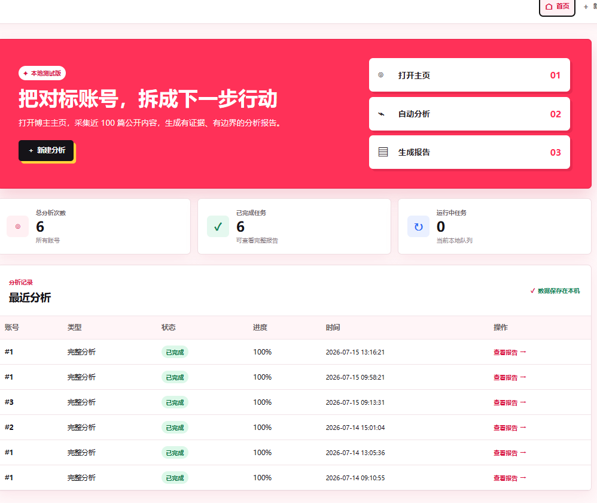
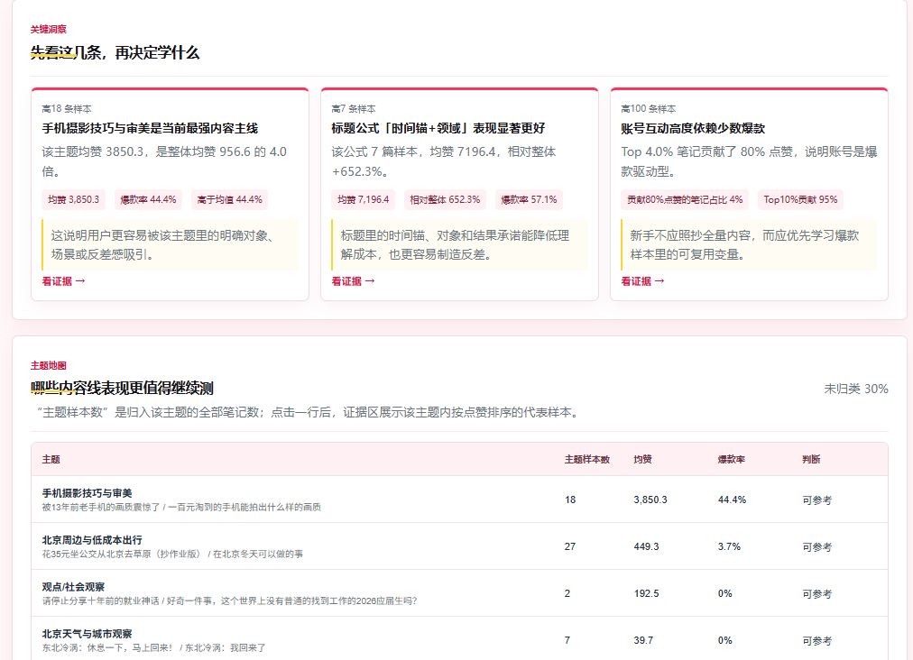
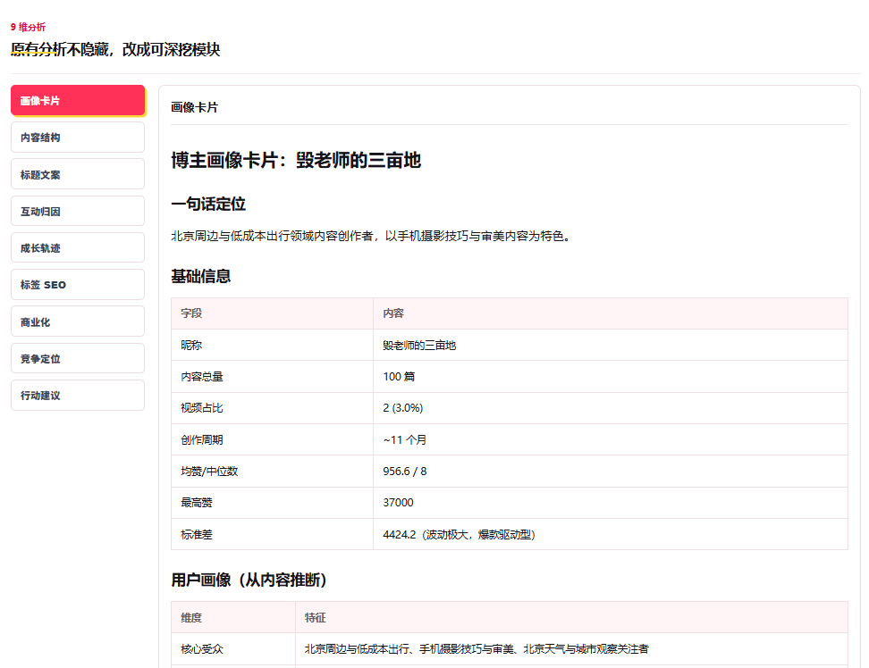

# XHS 博主分析助手

一个面向新手博主和小运营团队的本地分析工具。  
打开小红书博主主页，点击浏览器插件，就能把近 100 篇公开内容整理成一份可阅读的分析报告。

> 当前是测试版，本项目不是小红书官方工具。请只用于公开主页内容的学习、复盘和选题参考。



## 它能帮你做什么

如果你经常想研究一个对标账号，但不想手动抄表格、翻笔记、算点赞，这个工具可以帮你把这些事情自动整理出来：

- 看这个账号目前最值得学习的内容主线
- 找出表现更好的主题、标题和选题方向
- 展示每个判断背后的真实样本证据
- 生成主题地图、关键洞察和下一步行动建议
- 保留原来的 9 维深度分析，适合继续细看
- 本地运行，不需要手动复制 Cookie，不默认上传到作者服务器

## 使用方式很简单

先启动本地工具，然后在浏览器里登录小红书，打开一个博主主页，点插件里的“分析当前博主”。


插件会把当前博主主页交给你电脑上的本地分析工具处理。分析完成后，会自动生成报告页面。

## 报告长什么样

报告首页会先给出最重要的结论：这个账号值得学习什么、样本够不够、数据是否可靠、哪些模块因为数据不足被降级。


继续往下看，可以看到关键洞察和主题地图。主题不是只靠固定关键词硬套，而是会结合账号自己的标题和正文，尽量识别这个账号真实反复出现的内容线。



原来的 9 维分析不会被藏起来，而是改成了可继续深入查看的模块。



## 适合谁

适合：

- 刚开始做小红书的新手博主
- 想研究对标账号的小运营团队
- 想快速复盘账号内容结构的人
- 想把公开内容整理成选题参考的人

暂时不适合：

- 想做大规模监控的人
- 想批量高频采集很多账号的人
- 想得到平台官方数据结论的人
- 完全不愿意安装本地工具的人

## 第一次怎么安装

当前测试版主要支持 Windows + Chrome / Edge。

你需要先安装：

- Chrome 浏览器或 Edge 浏览器
- Python 3.9 或更新版本
- Node.js LTS 版本

下载或拿到内测压缩包后，先解压，然后双击：

```text
install_windows.bat
```

这个步骤只需要做一次。安装完成后，以后每次使用前双击：

```text
start_windows.bat
```

浏览器正常会自动打开：

```text
http://127.0.0.1:5173
```

更完整的小白安装说明看这里：

[docs/USER_GUIDE.md](docs/USER_GUIDE.md)

## 安装浏览器插件

Chrome 地址栏输入：

```text
chrome://extensions/
```

Edge 地址栏输入：

```text
edge://extensions/
```

打开开发者模式后，点击“加载已解压的扩展程序”或“加载解压缩的扩展”。


选择项目里的这个文件夹：

```text
browser-extension
```

看到 `XHS Analyzer Helper` 出现在扩展列表里，就说明插件装好了。


可以把插件固定到浏览器工具栏，之后使用会更方便。


## 日常使用步骤

1. 双击 `start_windows.bat`，启动本地工具。
2. 在 Chrome 或 Edge 里登录小红书。
3. 打开要分析的博主主页。
4. 点击浏览器右上角插件图标。
5. 点击“分析当前博主”。
6. 等报告页面生成。

如果插件提示“先打开博主主页”，说明当前页面不是博主主页。  
如果插件提示“本地工具没启动”，说明 `start_windows.bat` 没有启动，或者黑色窗口被关掉了。

## 隐私和使用边界

这个工具是本地优先：

- 插件只把必要信息发送到你自己电脑上的 `127.0.0.1`
- 不需要你手动复制 Cookie
- 不需要你提供小红书密码
- 不会默认上传数据到作者服务器

为了降低异常访问风险，建议：

- 一次只分析一个账号
- 不要连续高频分析大量账号
- 报告只作为样本观察，不要说成平台官方数据
- 遇到登录失效、请求失败或页面提示异常时，先停止任务

## 给维护者

生成一份适合分发的内测压缩包：

```powershell
powershell -ExecutionPolicy Bypass -File scripts/package_beta.ps1 -Version beta
```

生成文件：

```text
release/xhs-blogger-analyzer-beta.zip
```

分发和上线建议看：

[docs/SHARING_GUIDE.md](docs/SHARING_GUIDE.md)

产品规划和开发计划看：

[docs/MVP_PRD.md](docs/MVP_PRD.md)  
[docs/MVP_DEVELOPMENT_PLAN.md](docs/MVP_DEVELOPMENT_PLAN.md)

## 开发启动

后端：

```bash
pip install -r requirements.txt
uvicorn backend.app:app --reload --port 8000
```

前端：

```bash
cd frontend
npm install
npm run dev
```

打开：

```text
http://localhost:5173
```
