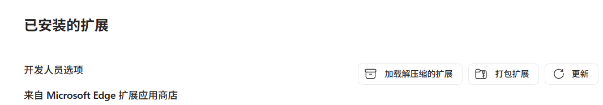
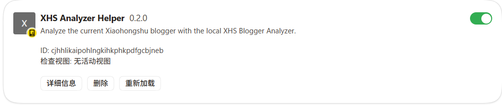
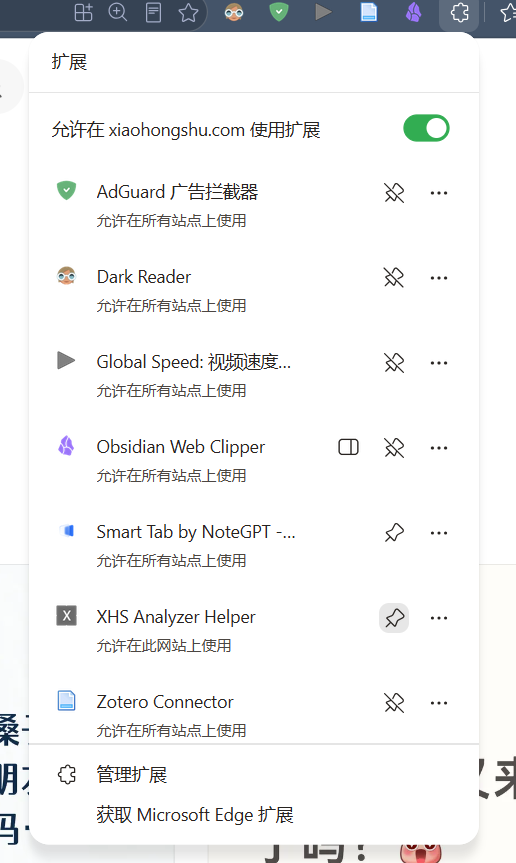
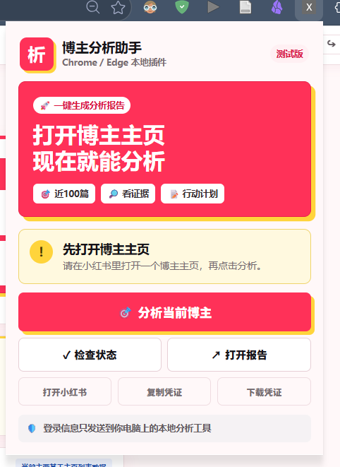
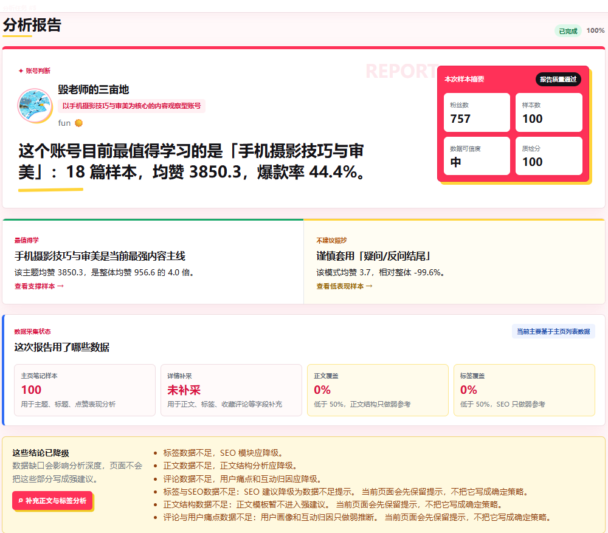

# XHS 博主分析助手：小白安装使用说明

这份说明写给完全不懂技术的用户。你不需要会写代码，也不需要 GitHub 账号。

## 一句话说明

这个工具可以帮你分析一个小红书博主主页最近约 100 篇公开内容，并生成一份本地分析报告。

使用时只需要做三件事：

1. 打开本地分析工具。
2. 在浏览器里登录小红书。
3. 打开要分析的博主主页，点击插件里的“分析当前博主”。

## 重要说明：不能只安装插件

当前测试版不是“单独一个浏览器插件就能完成全部分析”的形态。

插件主要负责：

- 识别你当前打开的是不是小红书博主主页。
- 读取当前浏览器里的登录状态。
- 把分析请求发送给你电脑上的本地分析工具。

真正负责采集、分析和生成报告的是本地工具，也就是 `backend`、`frontend` 和 `start_windows.bat` 启动的服务。

所以只安装 `browser-extension` 文件夹是不够的。  
如果没有先启动 `start_windows.bat`，插件会提示“本地工具没启动”，也无法生成报告。

## 你需要准备什么

需要一台 Windows 电脑，并安装：

- Chrome 浏览器或 Edge 浏览器。
- Python 3.9 或更新版本。
- Node.js LTS 版本。

如果你拿到的是作者打包好的内测压缩包，里面应该包含：

```text
xhs-blogger-analyzer/
  install_windows.bat
  start_windows.bat
  browser-extension/
  frontend/
  backend/
  docs/
```

## 第一次安装

### 第 1 步：解压文件

把压缩包解压到一个容易找到的位置，例如：

```text
桌面/xhs-blogger-analyzer
```

不要直接在压缩包里面双击文件，一定要先解压。

### 第 2 步：安装依赖

打开解压后的文件夹，双击：

```text
install_windows.bat
```

这个步骤只需要做一次。

如果弹出黑色窗口，不要关闭，等它自动安装。第一次可能会比较慢。

看到类似下面的提示后，说明安装完成：

```text
Setup finished. Next time, double-click start_windows.bat.
```

如果提示找不到 Python 或 Node.js，先安装对应软件，再重新双击 `install_windows.bat`。

## 每次使用前：启动本地工具

打开工具文件夹，双击：

```text
start_windows.bat
```

它会打开两个黑色窗口：

- 一个是后端服务。
- 一个是网页服务。

使用工具时不要关闭这两个窗口。关闭后，插件就连不上本地工具了。

正常情况下，浏览器会自动打开：

```text
http://127.0.0.1:5173
```

如果没有自动打开，你可以手动复制这个地址到浏览器地址栏。

## 安装浏览器插件

插件只需要安装一次。

安装过程中你会看到类似下面的页面和按钮。

### Chrome 安装方式

1. 打开 Chrome。
2. 在地址栏输入：

```text
chrome://extensions/
```

3. 打开右上角“开发者模式”。
4. 点击“加载已解压的扩展程序”。
5. 选择工具文件夹里的：

```text
browser-extension
```

6. 安装成功后，浏览器右上角会出现插件图标。

### Edge 安装方式

1. 打开 Edge。
2. 在地址栏输入：

```text
edge://extensions/
```

3. 打开“开发人员模式”。
4. 点击“加载解压缩的扩展”。



5. 选择工具文件夹里的：

```text
browser-extension
```

看到类似下面的卡片，说明插件已经安装成功，并且是启用状态。



接着可以把插件固定到浏览器右上角，之后点击图标就能使用。



## 怎么分析一个博主

1. 先确认 `start_windows.bat` 已经启动，本地网页能打开。
2. 在 Chrome 或 Edge 里登录小红书。
3. 打开你想分析的博主主页。
4. 点击浏览器右上角的插件图标。
5. 点击“分析当前博主”。
6. 等报告页面自动打开。

博主主页通常长这样：

```text
https://www.xiaohongshu.com/user/profile/用户ID
```

插件打开后大概长这样：



分析完成后，你会看到类似这样的报告：



## 常见问题

### 插件提示“本地工具没启动”

说明你还没有双击 `start_windows.bat`，或者启动窗口被关掉了。

解决方法：

1. 回到工具文件夹。
2. 双击 `start_windows.bat`。
3. 等网页打开后，再点插件分析。

### 插件提示“先打开博主主页”

说明你当前打开的不是博主主页。

请先打开某个小红书博主的主页，再点插件。

### 插件提示“还没有检测到登录”

说明你还没有在当前浏览器登录小红书。

解决方法：

1. 打开 `https://www.xiaohongshu.com/`。
2. 登录你自己的小红书账号。
3. 刷新博主主页。
4. 再点插件分析。

### 分析一直没有结束

先不要连续点很多次。

建议：

1. 等 1-3 分钟。
2. 看本地网页里的任务进度。
3. 如果失败，按页面提示处理。

### 可以同时分析很多账号吗

不建议。

第一版为了降低异常访问风险，建议一次只分析一个账号。等一个报告完成后，再分析下一个。

## 隐私说明

这个工具是本地优先：

- 插件只把必要信息发送到你自己电脑上的 `127.0.0.1`。
- 不需要你手动复制 Cookie。
- 不需要你提供小红书密码。
- 不会默认上传数据到作者服务器。

但你仍然要注意：

- 不要把自己的工具文件夹随便发给陌生人，里面可能有本地数据。
- 不要频繁批量分析大量账号。
- 不要把报告说成官方数据或平台保证结论。

## 卸载方式

### 关闭工具

关闭两个黑色窗口即可。

### 删除插件

1. 打开 `chrome://extensions/` 或 `edge://extensions/`。
2. 找到 `XHS Analyzer Helper`。
3. 点击“移除”。

### 删除本地文件

如果不想用了，可以删除整个 `xhs-blogger-analyzer` 文件夹。
